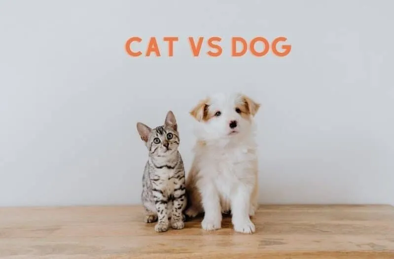
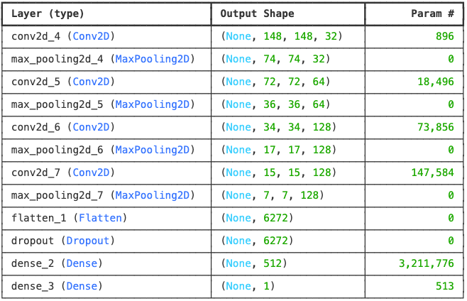

# meow

A deep learning model built with TensorFlow/Keras to classify images of cats and dogs using Convolutional Neural Networks (CNNs).


<p align='center'>
    
</p>

## Content

- [Overview](#overview)
- [Results](#results)
- [Installation](#installation)
- [Make Prediction](#make-predictions)
- [Key Features](#key-features)
- [Dataset](#dataset)

##  Overview

This project implements a binary image classifier that can distinguish between images of cats and dogs. The model is built using a Convolutional Neural Network (CNN) architecture and achieves high accuracy on validation data. This serves as a fundamental computer vision project, demonstrating key concepts in deep learning for image classification.

<p align='center'>
    
</p>

## Results

| `accuracy` | `loss` | `val_accuracy` | `val_loss` |
| --- | --- | --- | --- |
| 0.9895 | 0.0350 | 0.7600 | 1.0924 |


## Installation

1. **Clone the repository**
```bash
git clone https://github.com/pxsa/meow.git
cd meow
python -m venv venv
source venv/bin/activate  # On Windows: venv\Scripts\activate
pip install -r requirements.txt
```
2. Download the dataset


## Make Predictions

```python
from tensorflow.keras.models import load_model
from tensorflow.keras.preprocessing import image
import numpy as np

# Load the trained model
model = load_model('cats_vs_dogs_model.h5')

# Load and preprocess an image
img_path = 'path/to/your/image.jpg'
img = image.load_img(img_path, target_size=(150, 150))
img_array = image.img_to_array(img)
img_array = np.expand_dims(img_array, axis=0) / 255.0

# Make prediction
prediction = model.predict(img_array)
if prediction < 0.5:
    print("It's a cat! 🐱")
else:
    print("It's a dog! 🐶")
```

### Key Features
- Binary image classification (Cats vs Dogs)
- Custom CNN architecture with multiple convolutional layers
- Data augmentation for improved generalization
- Real-time prediction on new images
- Training visualization with accuracy and loss curves

##  Dataset

[Kaggle](https://www.kaggle.com/c/dogs-vs-cats/data)
